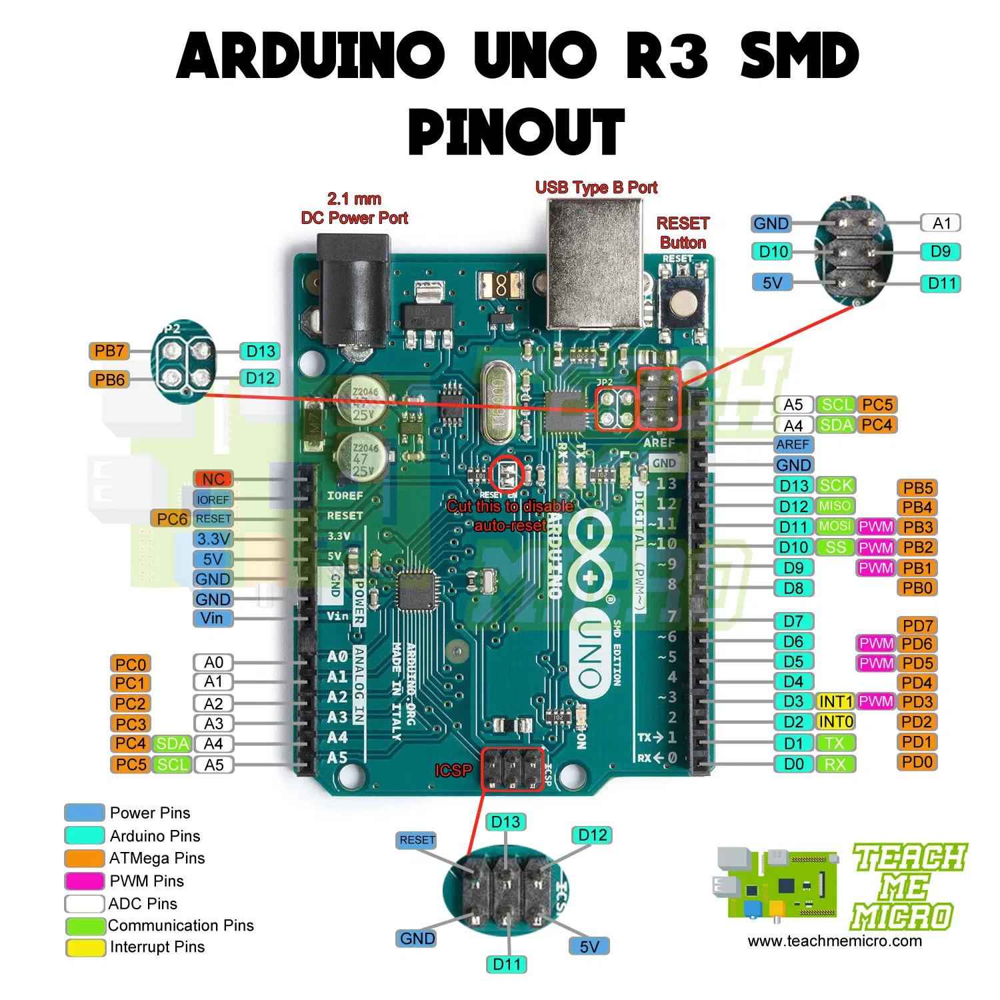

<h3> Arduino Pin Out Diagram</h3>

<h3> Arduino Uno Specification </h3>

* Microcontroller: ATmega328P
* Operating Voltage: 5V 
* Input Voltage (recommended): 7-12V
* Inout Voltage (limit): 6-20V 
* Digital I/O Pins: 14 (of which 6 provide PWM output) 
* PWM Digital I/O Pins: 6 
* Analog Input Pins: 6 
* DC Current per I/O Pin: 20 mA 
* DC current for 3.3V Pin: 50 mA 
* Flash Memory: 32 KB (ATmega328P) of which 0.5 KB used by bootloader
* SRAM: 2 KB (ATmega328P)
* EEPROM: 1 KB (ATmega328P)
* Clock Speed: 16 MHz
* LED_BUILTIN: 13
* Length: 68.6 mm 
* Width: 58.4 mm 
* Weight: 25 g 
